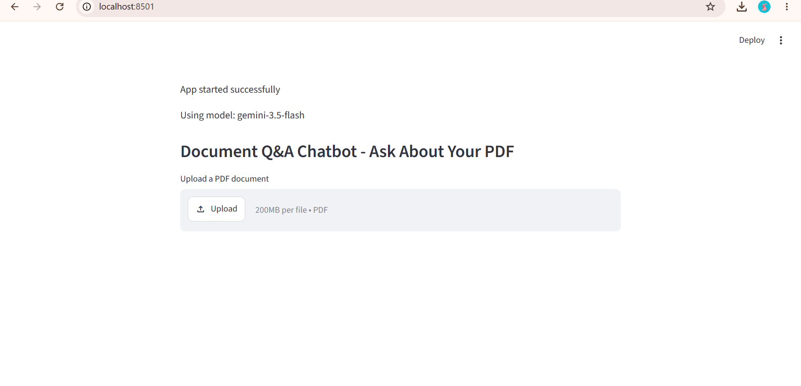

# 📄 RAG PDF Chatbot

An AI-powered chatbot that answers questions from PDF documents using **Retrieval-Augmented Generation (RAG)**.

This project uses **LangChain**, **ChromaDB**, and **Google Gemini** to retrieve relevant information from uploaded PDFs and generate context-aware answers. It was built as a hands-on project to understand document retrieval, vector databases, embeddings, and LLM integration.

---

## ✨ Features

- Upload and analyze PDF documents
- Ask questions in natural language
- Context-aware answers using RAG
- Semantic search with vector embeddings
- Powered by Google Gemini
- Simple Streamlit interface

---

## 🛠️ Tech Stack

- **Python**
- **Streamlit**
- **LangChain**
- **ChromaDB**
- **Google Gemini API**
- **PyPDF**
- **python-dotenv**

---

## 📁 Project Structure

```
RAG-pdf-chatbot/
├── app.py
├── requirements.txt
├── .gitignore
├── README.md
├── .env              # Local only (not committed)
└── uploaded_document.pdf
```
📸 Screenshots
Home Interface



---

## 🚀 Installation

### 1. Clone the repository

```bash
git clone https://github.com/Tanishkaaggarwal13/RAG-pdf-chatbot.git
cd RAG-pdf-chatbot
```

### 2. Install dependencies

```bash
pip install -r requirements.txt
```

### 3. Create a `.env` file

```env
GOOGLE_API_KEY=YOUR_GEMINI_API_KEY
```

> Replace `YOUR_GEMINI_API_KEY` with your own Google Gemini API key.

### 4. Run the application

```bash
streamlit run app.py
```

---

## 💡 How It Works

1. Upload a PDF document.
2. The PDF text is extracted and split into smaller chunks.
3. Embeddings are generated and stored in ChromaDB.
4. When a question is asked, the most relevant chunks are retrieved.
5. Google Gemini generates an answer based on the retrieved context.

---

## 🔮 Future Improvements

- Support multiple PDF uploads
- Display source references
- Save chat history
- Better UI/UX
- Deploy the application online

---

## 👩‍💻 Author

**Tanishka Aggarwal**

- GitHub: https://github.com/Tanishkaaggarwal13
- LinkedIn: https://linkedin.com/in/tanishka-aggarwal-321634346

---
